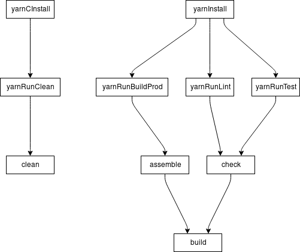

# Yarn Plugin

## Mission Statement

The idea is to provide a minimum viable plugin for orchestrating yarn.

## Requirements

Yarn should already be installed and available on the command line.

The following scripts should be defined in your `package.json`:
- `clean` - links to the `clean` task
- `build:prod` - links to the `assemble` task
- `lint` - links to the `check` task
- `test` - links to the `check` task

## Task Graph

Visualisation of the tasks the plugin creates and how it hooks in to existing tasks

